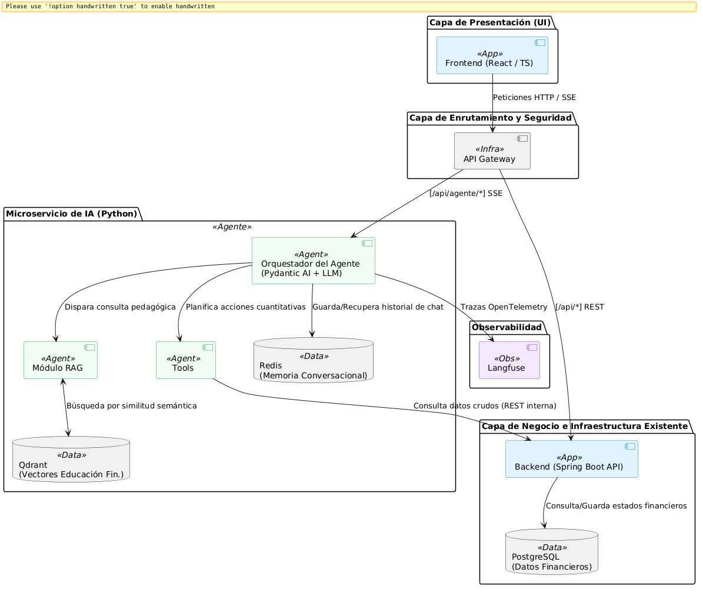

# Trabajo Práctico N° 2 — Agente Inteligente basado en LLMs

**Asistente de Consulta Analítica e Inteligencia Financiera**

Materia: Inteligencia Artificial — UTN Santa Fe  
Docentes: Dr. Jorge Roa — Dra. Milagros Gutiérrez

Integrantes:
- Alzugaray Tomás
- Mazzuchini Franco
- Nicle Santiago
- Lazzarini Bautista

---

## Descripción

Este proyecto implementa un **agente conversacional inteligente** sobre un sistema de gestión de finanzas personales. El agente, denominado *Asistente de Consulta Analítica e Inteligencia Financiera*, permite al usuario interactuar en lenguaje natural para consultar sus transacciones, analizar gastos e ingresos, proyectar escenarios financieros y recibir recomendaciones de educación financiera contextualizadas para Argentina.

El agente opera como un microservicio Python desacoplado, se comunica con el frontend mediante Server-Sent Events (streaming de tokens en tiempo real) y consume APIs internas del backend Spring Boot para recuperar los datos financieros del usuario. Utiliza el patrón ReAct (Reasoning and Acting) para decidir qué herramientas invocar según la consulta del usuario, delegando los cálculos numéricos a módulos determinísticos para garantizar precisión matemática.

## Diagrama de arquitectura



## Stack tecnológico

| Componente | Tecnología |
|---|---|
| Framework de agentes | Pydantic AI (Python) |
| Modelo de lenguaje | Llama 3.3 70B (Groq API) |
| Servidor web | FastAPI + Uvicorn |
| Base de datos vectorial (RAG) | Qdrant |
| Memoria conversacional | Redis |
| Backend de datos | Spring Boot 3 + PostgreSQL |
| Frontend | React 18 + TypeScript + Vite |
| Observabilidad | Langfuse + OpenTelemetry |

## Herramientas del agente

1. **`tool_filtrar_transacciones`** — Recupera ingresos y gastos en efectivo/débito del backend, con filtros por mes, año, categoría y contacto.
2. **`tool_filtrar_compras_credito`** — Recupera consumos con tarjeta de crédito, incluyendo cuotas, montos y comercios.
3. **`tool_calculadora_estadistica`** — Módulo determinístico con 9 operaciones (sumar, promediar, agrupar, balance, proyección de crédito, etc.). El LLM delega aquí todos los cálculos.
4. **`tool_recuperacion_RAG`** — Busca en la base de conocimiento financiera indexada en Qdrant para fundamentar recomendaciones pedagógicas.

## Requisitos previos

- [Docker](https://docs.docker.com/engine/install/) y [Docker Compose](https://docs.docker.com/compose/install/)
- Una API Key de [Groq](https://console.groq.com/) (gratuita)
- Credenciales de OAuth2 de [Google Cloud Console](https://console.cloud.google.com/) para la autenticación

## Puesta en marcha

```bash
# 1. Clonar el repositorio
git clone <url-del-repositorio>
cd tp2-inteligencia-artificial

# 2. Copiar y configurar variables de entorno
cp .env.example .env
# Editar .env completando:
#   - GROQ_API_KEY (requerido para el agente)
#   - GOOGLE_CLIENT_ID y GOOGLE_CLIENT_SECRET (requerido para login)
#     (No sabíamos si agregar nuestras API key de Google por temas de seguridad,
#     en el .enc.example pero si tienen problemas para la obtención de estas 
#     credenciales, les proporcionamos las nuestras).
#   - Opcional: LANGFUSE_PUBLIC_KEY y LANGFUSE_SECRET_KEY

# 3. Construir e iniciar todos los servicios, la base de conocimiento RAG debería indexarse
docker-compose up -d --build

# 4. De no indexar la base de conocimiento RAG automáticamente, ejecutar el siguiente comando
docker exec python-agente-ia python -m app.rag.ingester

# 5. Acceder a la aplicación
#    Frontend: http://localhost:3100
#    Agente IA (health): http://localhost:8000/health
```

> **Nota:** La primera vez que arranca el agente, el modelo de embeddings se descarga de Hugging Face (~470 MB), lo que puede demorar algunos minutos. Una vez cacheado, el arranque es inmediato en reinicios posteriores.

## Servicios Docker

| Servicio | Puerto | Descripción |
|---|---|---|
| `frontend` | 3100 | Aplicación React |
| `backend` | 8080 | API Spring Boot |
| `agente` | 8000 | Microservicio del agente IA |
| `db` | 5432 | PostgreSQL |
| `qdrant` | 6333 | Base de datos vectorial |
| `redis` | 6379 | Memoria conversacional |
| `pgadmin` | 5050 | Administración de base de datos |
| `redisinsight` | 5540 | Administración de Redis |

## Uso

1. Iniciar sesión en la aplicación (requiere cuenta Google).
2. Seleccionar o crear un espacio de trabajo.
3. Navegar a la sección *Agente IA* desde el menú lateral.
4. Escribir consultas en lenguaje natural, por ejemplo:
   - *"¿Cuánto gasté en supermercado este mes?"*
   - *"¿Cuál fue el gasto mas grande que hice este mes?"*
   - *"¿Cuantas cuotas adeudo?"*
   - *"¿Qué consejo me darías para ahorrar algo de dinero?"*

## Documentación relacionada

- [TP2-Parte 1.md](TP2-Parte%201.md) — Diseño conceptual del agente
- [TP2-Parte 2.md](TP2-Parte%202.md) — Informe de implementación
- [agente/TOOLS.md](agente/TOOLS.md) — Especificación detallada de herramientas
- [agente/docs RAG/](agente/docs%20RAG/) — Base de conocimiento financiero
